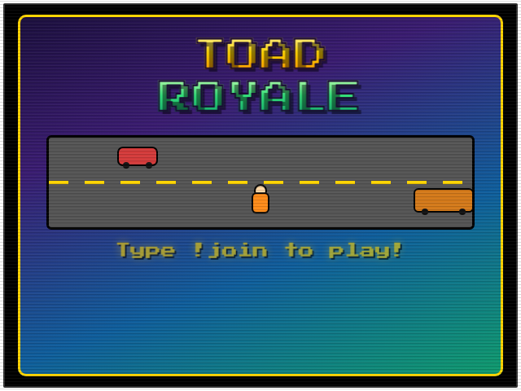

# Toad Royale - Twitch Chat Mini-Game

A local OBS Browser Source mini-game inspired by Frogger. Viewers type
`!join` in chat to enter a 60-second lobby, then hop across a series of
increasingly dangerous themed stages one at a time - anyone who doesn't make
it is eliminated, and the field narrows stage by stage until exactly one
Champion remains. Stats persist between streams.



> Looking for design notes, bug postmortems, or test logs instead? See
> [DEVELOPMENT.md](DEVELOPMENT.md).

## What's in this folder

| File/Folder | What it is |
|---|---|
| `index.html` | The game itself. Add this as an OBS Browser Source. |
| `config.js` | Your Twitch channel name. Edit this before running. |
| `server.py` | Local backend that stores stats. Run this alongside OBS. |
| `server.exe` | Optional pre-built version of `server.py` - no Python required (see below). |
| `demo/index.html` | Self-contained demo build - no backend, no setup, fake data. |
| `StreamData/` | Created automatically - holds `toad_stats.json`. |

## 1. Set your Twitch channel

Open `config.js` in any text editor and change the channel name:

```js
const GAME_CONFIG = {
  channel: "YourChannelNameHere"
};
```

No other code changes are needed to point the game at your channel.

## 2. Run the backend

The backend stores player stats and serves them to the game. Pick one:

**Option A - Python installed:**
```
python server.py
```

**Option B - no Python (Windows):**
```
server.exe
```

Either way, leave the console window running while you stream - it's the
server. On first run it automatically creates a `StreamData\toad_stats.json`
file next to itself - you don't need to create any folders yourself.

Default port is `5050` (different from Par 3's `5000`, so both games can run
at the same time). To use a different port:
```
python server.py --port 6050
```
If you change the port, also edit the `API_BASE` constant near the top of
`index.html`'s `<script>` block to match (e.g. `http://localhost:6050`) -
this isn't automatic.

## 3. Add it to OBS

1. In OBS, add a **Browser Source**.
2. Point it at the local `index.html` file (check "Local file").
3. Set the source size to **640 x 480** (matches the game's 4:3 stage).
4. Background is already transparent - no chroma key needed.

## How a round plays out

- **Lobby** - 60s countdown while players `!join`. Needs at least 2 players.
- **Country Road** - ~75% of players advance.
- **Swamp** - ~60% advance, hopping log to log.
- **Highway** - ~45% advance.
- **Sudden Death** (if more than one player is still standing after Highway)
  - repeated ~50%-survival rounds until exactly one Champion remains.
- **In Memoriam** - a tombstone screen honors each eliminated player with a
  themed epitaph before the final results are shown.

Every stage guarantees at least 2 survivors (1 in Sudden Death) as long as
enough players entered, so an unlucky run of bad rolls can never wipe out the
whole field in one stage.

## Chat commands

| Command | Who | Effect |
|---|---|---|
| `!join` | anyone | Joins the queue; opens the lobby if it's the first join of a cycle |
| `!stats` | anyone | Shows the requester's own stats on screen for a few seconds (games played, wins/losses, total points). Only works when idle. |
| `!resettoad` | broadcaster only | Wipes all saved stats |

## Testing without Twitch chat

Open `index.html?dev=1` in a browser (or click the small **`dev`** button in
the top-left corner) to get a Dev Console panel with buttons to simulate
`!join`, flood the lobby with random players, and trigger `!resettoad` -
without needing a live Twitch connection. Click **Connect to Twitch Chat**
from inside dev mode to test against real chat while keeping the simulator
panel visible. Drop `?dev=1` (or toggle `dev` off) to go fully live.

## Demo build (no backend, no setup)

`demo/index.html` is a self-contained copy for showing the game off without
running `server.py`/`server.exe` at all - open it directly in a browser, or
host it anywhere static (GitHub Pages, etc.). It always runs in dev mode with
seeded example stats that reset on reload.

## Building `server.exe` yourself

If you'd rather build the standalone exe than use the one included here:
```
pip install pyinstaller
pyinstaller --onefile --name server server.py
```
Move the resulting `server.exe` from `dist/` to the project root, next to
`index.html`.

## Notes

- If you run this alongside Par 3 at the same time, a viewer's `!join` goes
  to whichever game's lobby is currently open.
- The whole folder is portable - copy it (including `StreamData/` if you
  want to keep existing stats) to another machine or a USB drive and it
  works as-is.
